# Farm Tower TD Defense 

## Team Members 

Teddy Starynski – https://github.com/ReddishBlue 

Brady Bock - https://github.com/bbock27 

Lucy Malmud – https://github.com/lmalmud 

## Game Summary 

You are a farmer on a frontier world settling the land. However, there are hungry monsters lurking in the shadows waiting to eat your crops and livestock. But the land is really good for growing crops. Get money by farming during the daytime and buying towers to defend your land from the monsters at night. You’ll have to manage your time wisely, fight bravely, and act strategically to ensure the survival of yourself and your crops. 

## Genres 

This will be a tower defense game that is played from the first-person perspective. It will include both strategy (in the tower defense component) and simulation (in the farming aspect) 
- Tower defense 
- First person
- Farming sim 
- Strategy 

## Inspiration 

### Rogue Tower 

Rogue Tower is a roguelike tower defense game, where the map is expanded procedurally every wave. Specifically, the inspiration we took from this game comes from the game mode “Touch Grass (April Fools)”, where the game is played in first person. While this game mode was created as a joke in Rogue Tower, it can be pretty fun and is an interesting way to play a tower defense game. 

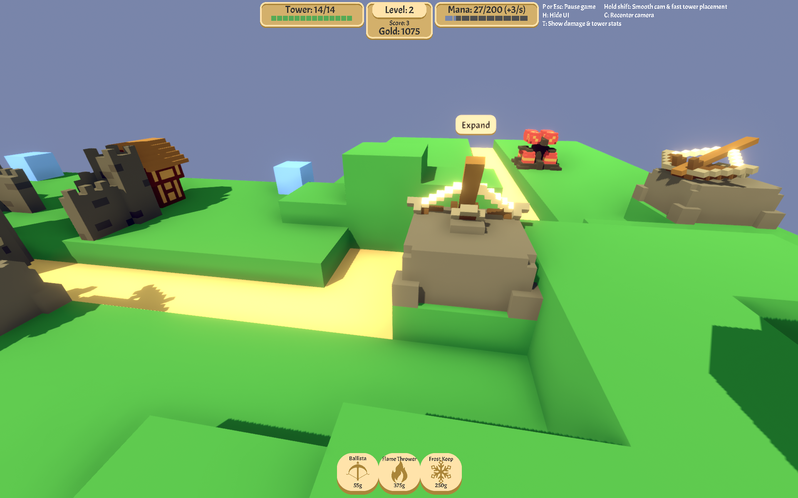 

### Love Death and Robots: Suits 

Suits is an episode from the Netflix show Love Death and Robots, where a group of farmers have mech suits that they pilot to defend their land from alien invaders. The subject matter of our game was inspired by this episode of the show! 

 

### Thronefall 

We really liked the art style of this game, and how bold the colors are. It’s a tower defense game, so some inspiration can also be drawn from the level design and mechanics. The player is a character that roams around in this game, instead of just an omniscient mouse that can place stuff down, so this is a good game to look at for making a tower defense game where the player character is an actual character in the world. 

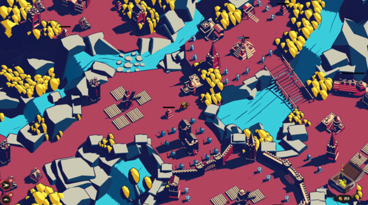 

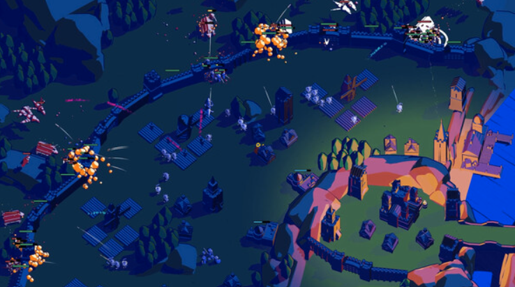 


### Bad North 

Another game that we like the art style of. Both Bad North and Thronefall have low-poly art styles and nice, soft lighting. The designs are very simplistic, but effective. 

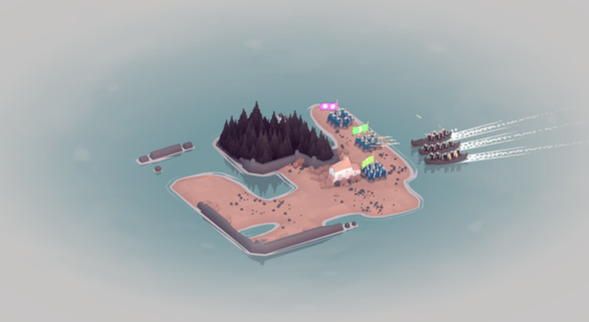 

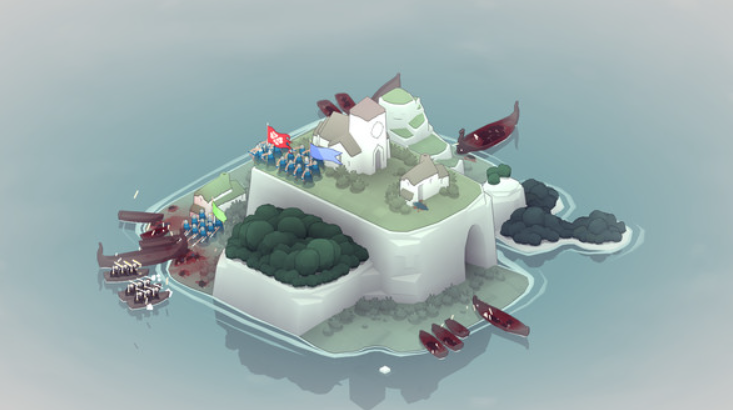 
 
### Plants vs. Zombies 

We’re taking inspiration from the sun and sunflowers mechanic. We plan to have plants that generate income (your farm), and the monsters will first destroy those plans, causing you to lose income. However, you can lose those plants and it won’t be game over yet (much like how you can lose your sunflowers in PvZ without a game over). However, if you let your plants get eaten, you lose out on income.  

### Minecraft 

One of our favorite parts of Minecraft was the farming- providing a peaceful, routine activity that integrated into the rest of the gameplay, yet has a different feel to some of the other activities players partake in. We are inspired by these mechanics, as well as some of the textures, designs, and properties of livestock and farming. 

 


## Gameplay 
**Core mechanics required:** 
- Day-night cycle 
    - During the daytime, the player is free from attacking enemies. They can plant crops and build/upgrade towers. 
    - During the nighttime, the enemies come along a set path. Your defenses must hold in order to protect your crops and the farmhouse where your family is sleeping (you can lose your planters but each enemy that gets to the farmhouse removes one of your lives) 
- At least one map 
    - The path the enemies take is static according to pre-made maps.  
    - There will be fixed locations where you can place towers.  
- A variety of towers
    - hitscan attacks
    - Medieval fantasy themes such as archer tower, cannon, wizard tower, etc. 
    - Each tower will have different damage capabilities and costs, requiring strategic thinking on the part of the player as to how best allocate their resources. 
    - The player will have the ability to place towers in different locations and of different types. 
- Farming mechanic 
    - There are set planters and you decide what crop goes in them  
    - crops give money after $x$ cycles 
    - Longer = more money but more of an investment 
    - Plants automatically replant themselves, the player just decides what goes in them
- Enemies
    - Enemies follow a pre-set pathway through the map clearly marked as a road for the player
    - A set of enemy types that vary in health, speed, etc.
      - slow but tanky
      - fast but weak


**Nice to have goals:** 
- Environment based effects on the towers, meaning placement matters.
    - Ex. Higher = more range 
    - The enemies target the planters 
    - Not buying enough defense directly impacts your eco. 
- Variety in maps 
    - Either you get a random map or the user selects one.  
- The player has an attack 
    - Allows for strategies where you invest more in eco at the beginning and use your skill attacking the enemies to avoid buying towers until necessary 

## Development Plan 

## Project Checkpoint 1-2: Basic Mechanics and Scripting (Ch 5-9) 

We first intend to implement the tower defense aspect of our game, layering on the farming components as time progresses. Before we have implemented the farming simulation aspect of the game (which is the mechanism that will enable players to get more and improved resources), we will include automatically allocated resources. This will allow for us to develop our game as though it were a regular tower defense, and later layer in the simulation aspect. 

Our goals for the first checkpoint will include: 

- ~~Implement basic map functionality such as a pre-generated map that will serve as the basis for the physical structure of gameplay using primitives~~
    - ~~Get an “enemy” to follow a preset path~~
- ~~A player that can move around the world~~ 
- ~~The ability to place primitive towers (not necessarily functional)~~
    - ~~Ex able to place a cube in the world.~~
- ~~At least one enemy~~
- ~~A win/lose condition~~

## Project Part 2: 3D Scenes and Models (Ch 3+4, 10)
- ~~Implement better aiming for the tower (instead of just aiming at the current position, take the enemy and bullet velocity into account) [LM]~~
- Implement better target selection for towers (i.e. does not hit the closest enemy but rather the one that is closest to the the goal) [LM]
    - Moved to next checkpoint
- ~~A second level~~
    - We did not add a second level, per se, but the day and night cycle
    - ~~Pathfinding system improvements so that paths may loop around on themselves [TS]~~
- ~~Apply new concepts from chapter 4 to the environment (ProBuilder?) to create a less basic terrain~~
- More complex models than just a capsule
    - ~~Enhanced tower prefab (& one variant, if time)~~
    - ~~Enhanced enemy prefab (& one variant, if time)~~
- ~~Text on the win/lose screen~~
    - We decided this would be for a different checkpoint
- ~~Add day/night loop with lighting~~
  - ~~Add multiple rounds to each level~~

Flowers that generate money. The texture is changed to show a transparent version as the player places the flowers.
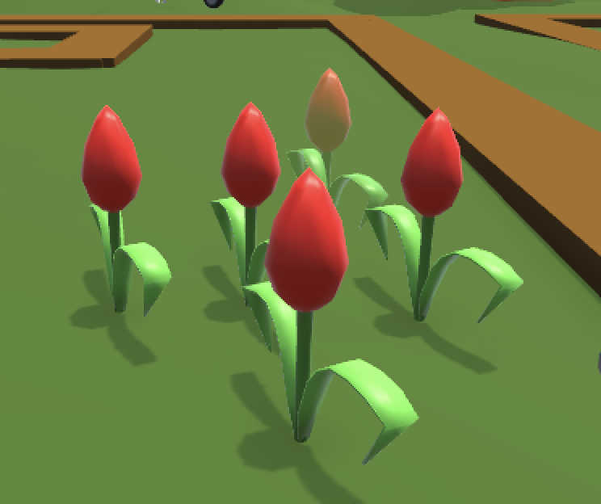

Different enemy prefabs- each spawns randomly. How cute!
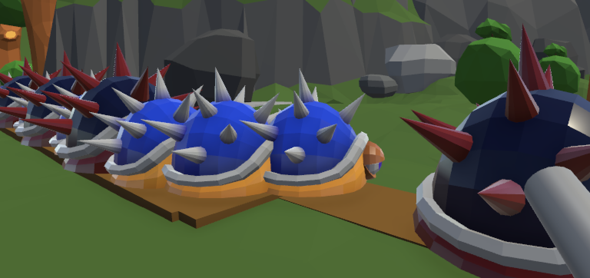

One of the tower variants with animated fire.
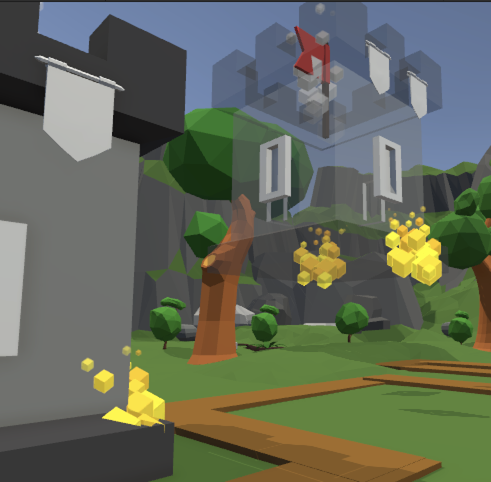

An overhead view of the map renders in the top right corner.
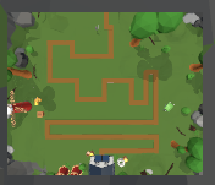

### Assets Added
* [Forest - Low Poly Toon Battle Arena / Tower Defense Pack](https://assetstore.unity.com/packages/3d/environments/forest-low-poly-toon-battle-arena-tower-defense-pack-100080)
* [LowPoly Environment Pack](https://assetstore.unity.com/packages/3d/environments/landscapes/lowpoly-environment-pack-99479)
* [Character model](https://assetstore.unity.com/packages/3d/characters/humanoids/lowpoly-survival-character-rio-273074)
* [Pandazole - Lowpoly Asset Bundle](https://assetstore.unity.com/packages/3d/props/pandazole-lowpoly-asset-bundle-226938)
* [skybox](https://assetstore.unity.com/packages/2d/textures-materials/sky/allsky-free-10-sky-skybox-set-146014)

### Additions
- Basic UI
- Tower preview for placement
- Plant stuff!
- Improved player movement and physics
- You cannot body-block the enemies


## Project Part 3: Visual Effects (Ch 11, 12, 13)
* ~~Incorporate decorations and better base assets from the separate scenes~~
* ~~Towers aim to enemy that is closest to goal~~
* ~~Add water tower variant~~
    * ~~Will slow down enemies and have particles~~
* ~~Add fire bullets that set enemies on fire~~
* ~~Effect on placing tower~~
* ~~Post processing effects (passive and when damage taken)~~

Revamped base (no longer just a cube!)
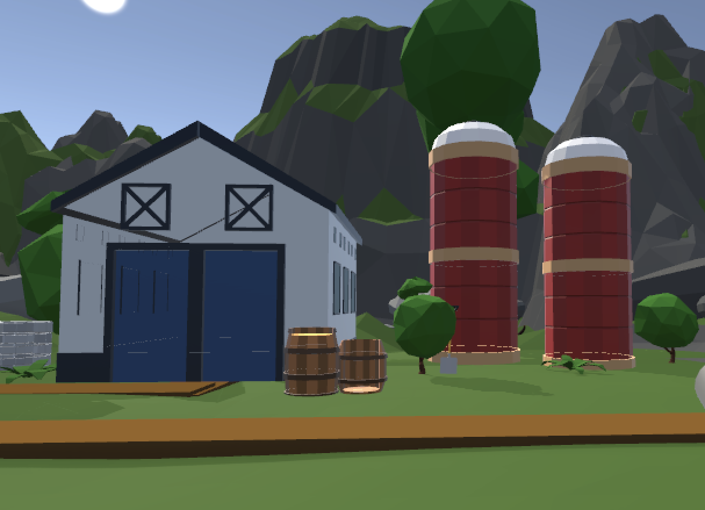

Fire tower deals a different amount of damage than the regular tower and applies a visual effect.
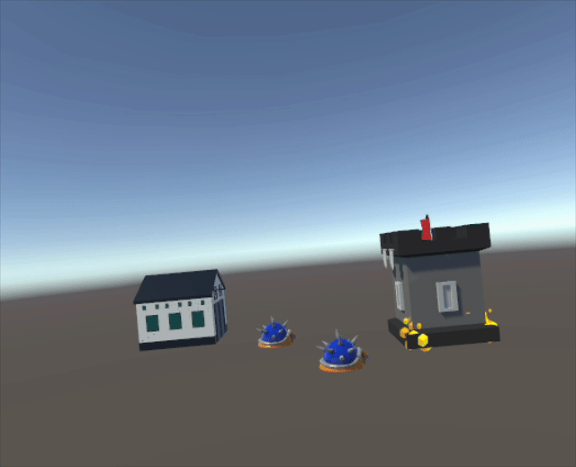

Water tower has a different bullet trail and will apply a slowing effect to enemies. Note also that towers shoot at the enemy that is closest to the base.
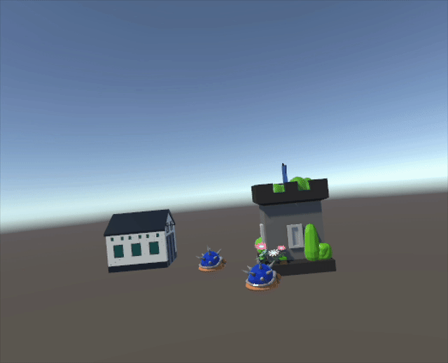

The spotlight from towers will point at the enemy it shoots at.
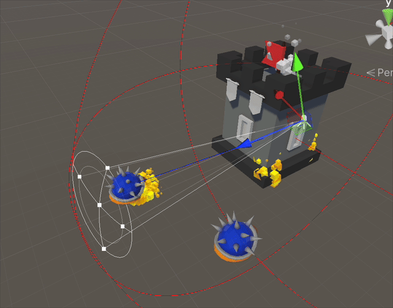

### Additions
* Removed mouse from screen
* The player has a flashlight
* Towers have a spotlight that track the enemy they shoot at
* Debug/testing controlled

## Project Checkpoint 3-4: Sound, UI, and Animation (Chapters 14, 15, 17)

* Footstep sound when walking
* make rooster quieter
* allow for the ability to select different tower types in game
* you plant a plot of crops each time instead of a single one
* animate flowers to be dynamic (wow so pretty)
* highlight on UI for which "mode" you're in
* tower sound effect (passive and active)
* certain towers deal DOT
* Text on win/lose screen

* Add [ambient music](https://assetstore.unity.com/packages/audio/music/free-10-medieval-ambient-fantasy-tracks-music-pack-310781)
* Added [shooting sound](https://assetstore.unity.com/packages/audio/sound-fx/shooting-sound-177096) to bullets

## Instructions for Testing the Project
* Play the ```Level 3``` scene
* Multiple tower variants exist, but you can only place one type because of UI reasons
* WASD to move around
* Space to jump
* 1, 2, 3 numbers to toggle between view mode, place tower, and place plant, respectively
* Money and lives are displayed in the top left of the screen
* You need to place plants in order to make more money
    * You cannot place a tower if you do not have enough money
    * You get a $500 stipend every day
* There are two waves of enemies i.e. two nights (one wave per night)
* press `m` to get free money (we love a good tax loophole)
* press `r` to freeze rotation
* press `esc` to rematerialize the cursor
* right click the mouse to toggle the flashlight in view mode
